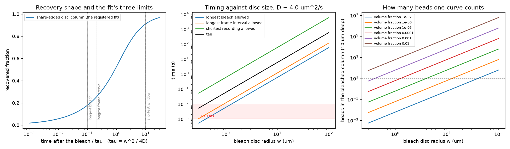

# sim-20260930-401, Stage 1: what bleaching a disc of 100 nm beads would show

*Generated by `simulation_agent/src/frap_stage1.py` from `stage1_closed_forms.json`; the JSON is the record. Written by simulation-kyuhwan-macbook-20260930-4 for task 025.*

## Can it be measured? Feasibility first

**Yes on timing, for bleach discs of about 3 to 30 um radius. Below about 1 um it is hard, and at 0.3 um it needs sub-millisecond bleaching and frames. Above about 30 um the record runs to many minutes and drift and imaging bleach bind first.** The fit the two sides agreed refuses a curve whose bleach is longer than a tenth of the recovery time tau, whose frame interval is longer than a fifth of it, or whose record is shorter than ten of it. Those three limits against disc size:

| disc radius (um) | tau (s) | longest bleach (ms) | longest frame interval (ms) | shortest record (s) | bleach rate needed (1/s) | volume fraction for 10 beads |
|---|---|---|---|---|---|---|
| 0.3 | 0.0052 | 0.52 | 1 | 0.052 | 1900 | 0.0019 |
| 0.5 | 0.015 | 1.5 | 2.9 | 0.15 | 690 | 0.00067 |
| 1 | 0.058 | 5.8 | 12 | 0.58 | 170 | 0.00017 |
| 2 | 0.23 | 23 | 47 | 2.3 | 43 | 4.2e-05 |
| 3 | 0.52 | 52 | 100 | 5.2 | 19 | 1.9e-05 |
| 5 | 1.5 | 150 | 290 | 15 | 6.9 | 6.7e-06 |
| 10 | 5.8 | 580 | 1200 | 58 | 1.7 | 1.7e-06 |
| 30 | 52 | 5200 | 10000 | 520 | 0.19 | 1.9e-07 |
| 100 | 580 | 58000 | 120000 | 5800 | 0.017 | 1.7e-08 |

**What decides it is how fast the beads bleach, and nobody knows that yet.** To leave a dip of about 60 per cent inside the longest allowed bleach, the dye has to bleach at the rate in the sixth column under the patterning light: about 20 per second for a 3 um disc, 170 per second for 1 um. The knowledge base holds no bleaching rate for these beads or this light. **Measure the bleaching rate under the patterning illumination first**; it decides the smallest disc that can work before any recovery is recorded.

**Large discs are easy on every limit above and hard on the record itself.** At 30 um tau is 52 s and at 100 um 580 s, so the shortest record the fit allows is 520 s and 5800 s -- many minutes to over an hour. Over a record that long, other things bind before diffusion does: bleaching by the imaging light (the fit's reference region corrects it only if that region sees exactly the same light), drift of the stage and focus, and the field of view, since the reference region must sit at least five disc radii away -- half a millimetre from a 100 um disc. None of these is in the model. The model's own numbers do not change with disc size: measured in recovery times and disc radii, the curve and the fit's biases below are the same at any w, so the second stage's runs at 3 um carry to any disc.

The bead count is not the limit at ordinary dilutions: a 3 um disc through a 10 um chamber holds ten beads already at a volume fraction of 2e-5. The bead count only binds for sub-micrometre discs, which the timing has already ruled out.

## How fast the beads diffuse

**D ~ 4 um^2/s** (Stokes-Einstein, 4.29 unrounded), from three inputs of different standing:

- diameter 100 nm: **the person's nominal size, not a measurement**. The knowledge base holds nothing on these beads -- its bead entries describe a different, 5 um bottle -- so the result is an order of magnitude and is carried to one figure;
- viscosity 1 mPa s: pure water near 293 K, from the knowledge base (a textbook value). That the beads sit in water and not a buffer is assumed;
- temperature 293 K: the room's thermometer reading. Nothing reads the sample, and a kelvin either way moves D by about two per cent.

Sedimentation does not matter: about 0.2 nm/s, a gravitational length of about 20 mm against a chamber tens of micrometres deep. That uses the density of a different bead's polystyrene and assumes these beads are polystyrene too.

Concentration does not enter D in the model, because the model's beads do not interact. What concentration would change a real suspension's self-diffusion -- and how much larger charged beads in deionised water behave than they are -- is not in the knowledge base, so no number is given. The volume fractions the counts call for (1e-6 to 1e-3) are dilute; concentration is a signal question here unless that missing entry says otherwise.

## The recovery against disc size

The bleach is a column through the whole sample depth, because the only way this microscope confines light is a patterned (DMD) widefield beam, which is not confined in depth. So the depth-integrated signal refills by two-dimensional diffusion, and the half-recovery time is 0.895 tau with tau = w^2 / 4D for a sharp-edged disc of radius w:

| disc radius (um) | half-recovery, sharp edge (s) | half-recovery, Gaussian edge (s) |
|---|---|---|
| 0.3 | 0.0047 | 0.0067 - 0.0074 |
| 0.5 | 0.013 | 0.019 - 0.02 |
| 1 | 0.052 | 0.074 - 0.082 |
| 2 | 0.21 | 0.3 - 0.33 |
| 3 | 0.47 | 0.67 - 0.74 |
| 5 | 1.3 | 1.9 - 2 |
| 10 | 5.2 | 7.4 - 8.2 |
| 30 | 47 | 67 - 74 |
| 100 | 520 | 740 - 820 |

A three-dimensional ellipsoidal bleach is not computed: this instrument cannot make one.

## Two limits of this answer, and how far they reach

Both were found by solving the diffusion equation with the bleach as it would really happen and fitting the result exactly as the agreed fit would. The solver reproduces the textbook recovery to within 0.00166 and returns D exactly on an ideal bleach, so these are effects of the bleach, not of the arithmetic.

1. **A bleach of finite length reads D low, even inside the allowed length.** Beads just outside the disc are bleached as they cross its edge. With a strong bleach the fitted D, using the radius measured on the first frame after the bleach as the fit does, comes out:

   | bleach length / tau | D fitted / D |
   |---|---|
   | 0.03 | 0.88 |
   | 0.1 | 0.76 |
   | 0.3 | 0.61 |
   | 1 | 0.43 |

   The fit's own bleach limit, a tenth of tau, still allows about 25 per cent low. That is a tie at the decade resolution asked for, and it would not be in a confirmatory measurement.

2. **A soft-edged disc reads D two to four times low, and the fit's radius check does not catch it.** A defocus-blurred pattern has soft edges; fitted with the sharp-edged model, a fully Gaussian edge gives:

   | bleach depth | radius at half contrast / nominal | D fitted / D |
   |---|---|---|
   | 0.5 | 0.64 | 0.24 |
   | 2 | 0.79 | 0.37 |
   | 5 | 1 | 0.55 |

   A real blurred disc sits between these and a sharp one. Still inside the decade, but large. **What removes both:** send back the measured first post-bleach profile and the actual bleach length, and the simulation is re-run with them, so the same bias sits on both sides of the comparison.

## What is assumed, and what replaces it

- disc radius 3 um as the working point, chamber depth 10 um, volume fraction 1e-4, and ten beads as the least a single curve can use: this agent's working values. The microscope plan's disc, chamber and dilution replace the first three; the second stage of this question measures the fourth.
- the 100 nm diameter: replaced by a measured size or the product's specification.
- **ten beads per curve has been replaced by a measurement**: the second stage finds one curve needs about 300 beads in the disc before its scatter is inside a factor of ten (see stage2_runs.md). Read the bead-count column of the first table above with that in mind: the volume fractions it needs are about 30 times those shown.

---
References: task 025; observable `bleach_recovery_diffusivity`; goal card `goal.json`; knowledge-base version kbv-49b098a90994.
