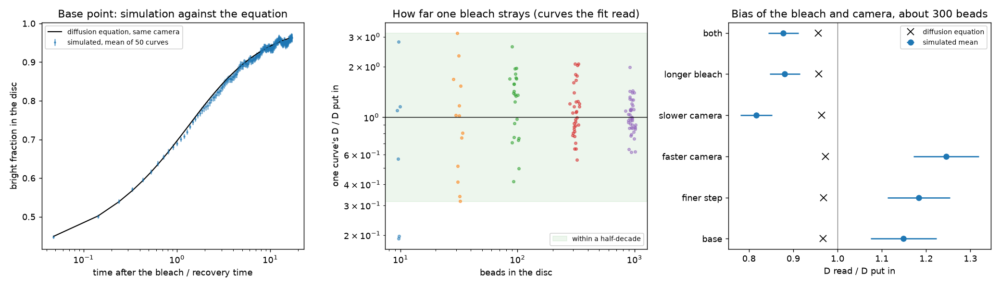

# sim-20260930-401, Stage 2: the bleach recovery simulated, bead by bead

*Generated by `simulation_agent/src/report_bleach.py` from the run files; `stage2_runs.json` beside this file is the record.*

## What the runs show

**One bleach places D in the right decade only above about 300 beads in the disc.** Below that, single curves scatter over more than a factor of ten and most are refused by the fit as bounds rather than read. The beads are counted through the whole depth of the bleached column, so at ordinary dilutions a disc of a few micrometres holds hundreds to thousands.

**The simulated recovery is the one the diffusion equation predicts, at every setting.** Averaged over fifty bleaches, the bright fraction in the disc stays within 3.2 standard errors of the equation at every frame, and at least 92 per cent of frames lie within two. That is the check this stage exists for: the simulation says nothing new about the real beads (their D is fixed by the size, the viscosity and the temperature put in), but it shows the bleach and the camera behave as planned before anyone spends sample on them.

**Averaging the D of single bleaches is biased, and the bias comes from the fit, not the beads.** The fit refuses a curve whose recovery looks too slow for the record or too fast for the frames, so the curves it keeps are a selected set. At a few hundred beads the mean of the kept curves reads from 0.82 to 1.26 of the true value, and the check declared before the runs -- that this mean matches the equation -- **fails** at 4 of 8 settings. **Average the curves first and fit once**: a fit to the mean curve reads 0.90, 1.09, 1.04, 1.29, 1.10, 1.02, 0.95, 0.98 at the same settings. (The mean-curve comparison was added after the data were seen, and is labelled so in the record.)

## How far one curve strays, against beads in the disc

Base settings: disc 3 um, frames every 50 ms, a 20 ms bleach, a 9 s record, 50 independent curves per row. D is given as a fraction of the value the beads were simulated with.

| beads in disc | curves the fit reads | one curve, middle 90 per cent (every fitted curve) | spread of that range | mean of the read curves |
|---|---|---|---|---|
| 10 | 6 of 50 | 0.0024 - 3.6 | x1.5e+03 | 1.00 +/- 0.40 |
| 32 | 13 of 50 | 0.00091 - 5.5 | x6e+03 | 1.16 +/- 0.23 |
| 96 | 23 of 50 | 0.024 - 3.2 | x1.3e+02 | 1.32 +/- 0.11 |
| 315 | 33 of 50 | 0.24 - 2.1 | x8.9 | 1.15 +/- 0.07 |
| 944 | 43 of 50 | 0.49 - 1.4 | x2.9 | 1.04 +/- 0.04 |
| 316 | 36 of 50 | 0.36 - 2.4 | x6.6 | 1.20 +/- 0.08 |

A curve the fit does not read is one it refuses: its fitted recovery time came out so short or so long against the frames, the bleach or the record that the curve can only bound D from one side. With few beads that is common, and it is part of the answer: a refused curve is a bleach that taught nothing.

## The bleach and the camera, against the diffusion equation

Each row is 50 curves at about 300 beads. 'Predicted' is what the diffusion equation gives when it is bleached, sampled and fitted exactly as the run is -- so a row that agrees shows the integrator, the bleach and the fit are working, and the size of the prediction is the bias itself.

| setting | frame / recovery time | bleach / recovery time | mean of kept single curves | fit to the mean curve | predicted | single-curve mean apart, in standard errors |
|---|---|---|---|---|---|---|
| base | 1/10 | 1/26 | 1.149 +/- 0.074 | 0.904 | 0.968 | 2.4 |
| finer engine step | 1/10 | 1/26 | 1.183 +/- 0.071 | 1.088 | 0.969 | 3.0 |
| base (second seed) | 1/10 | 1/26 | 1.199 +/- 0.077 | 1.038 +/- 0.082 | 0.968 | 3.0 |
| finer engine step (second seed) | 1/10 | 1/26 | 1.260 +/- 0.062 | 1.286 +/- 0.096 | 0.969 | 4.7 |
| faster camera | 1/26 | 1/26 | 1.245 +/- 0.073 | 1.100 | 0.973 | 3.7 |
| slower camera (near the limit) | 1/5 | 1/26 | 0.816 +/- 0.036 | 1.017 | 0.964 | 4.1 |
| longer bleach (near the limit) | 1/10 | 1/10 | 0.881 +/- 0.035 | 0.949 +/- 0.050 | 0.958 | 2.2 |
| both near the limit | 1/5 | 1/10 | 0.878 +/- 0.034 | 0.976 +/- 0.050 | 0.956 | 2.3 |

**The engine step: passes as declared, and leaves a question open.** A finer step (5 ms to 2 ms) moves the mean of the kept single curves from 1.149 to 1.183, 0.3 standard errors, which is the check declared before the runs, and it passes.

But on a second seed, with every curve saved, one fit to the mean curve reads 1.038 at 5 ms and 1.286 at 2 ms, 2.0 jackknife standard errors apart, and the finer-step runs are the two whose mean curves sit furthest from the equation on any frame (2.5 and 3.2 standard errors). The diffusion equation predicts no difference between the two steps. Whether this is chance or a small real effect of the step is not resolved by these runs; more curves at both steps would settle it. At the factor-of-ten resolution asked for it is a tie either way, and it would matter only for a confirmatory measurement.

## The 12 per cent single curve from the first trial

A first trial curve, before these runs, read D 12 per cent high at about a thousand beads (disc 3 um, bleach rate 200 per second for 50 ms, frames every 100 ms, a 6 s record). The diffusion equation, bleached and sampled the same way, predicts that setup reads 0.99 of the true value: the bleach lengthens the fitted recovery time by 17 per cent and the half-contrast radius grows by 8 per cent to match, and the two nearly cancel. So the 12 per cent is the scatter of one curve, not a bias -- about 0.5 standard deviations of one curve at that bead count.

## What binds as the disc grows

Measured in recovery times and disc radii the model is the same at every disc size, so nothing above changes with w. What changes is the clock, and the things the model leaves out bind on the clock. Computed from the same D (about 4 um^2/s) and the same sedimentation speed (about 0.2 nm/s) as the first stage; none of the last three columns is modelled.

| disc radius (um) | recovery time | shortest record the fit allows | reference region at least this far (um) | field of view at least (um) | settling over the record (um) | beads in a 10 um column at volume fraction 1e-6 |
|---|---|---|---|---|---|---|
| 1 | 58 ms | 582 ms | 5 | 12 | 0.00012 | 0.06 |
| 3 | 524 ms | 5.2 s | 15 | 36 | 0.001 | 0.54 |
| 10 | 5.8 s | 58 s | 50 | 120 | 0.012 | 6 |
| 30 | 52 s | 8.7 min | 150 | 360 | 0.1 | 54 |
| 100 | 9.7 min | 97 min | 500 | 1200 | 1.2 | 6e+02 |

Up to about 10 um the record is under a minute and these are small. From 30 um the record runs to many minutes and past an hour at 100 um: bleaching by the imaging light over that time (which the reference region corrects only if it sees the same light), drift of the stage and focus, and a field of view of a millimetre become the limits, and none of them is in this model.

## What this cannot say, and what is asked for

- The simulated D is the value put in. These runs check the method; they are not evidence about how the real beads move.
- The camera here counts beads perfectly: no blur, no photon noise, no background, no bleaching by the imaging light, no drift, no walls. Real curves scatter more than these.
- The bleach rate (50 per second) is a guess and sets how deep the dip is. **Measure the bleaching rate under the patterning light first**; with it, and the measured first frame after the bleach and the bleach length actually used, these runs are repeated with the real numbers so that the same small biases sit on both sides of the comparison.
- The disc size does not change these conclusions: measured in recovery times and disc radii the problem is the same at any disc, so a 30 um disc has the same biases and, at the same dilution, a hundred times more beads.

---
References: task 025; plan `v2_plan_simulation_sim-20260930-401.json`; runs `run-20260930-401-n10-dt-f12-b30`, `run-20260930-401-n30-dt-f12-b30`, `run-20260930-401-n100-dt-f12-b30`, `run-20260930-401-n300-dt-f12-b30`, `run-20260930-401-n1000-dt-f12-b30`, `run-20260930-401-n300-dt2-f12-b30`, `run-20260930-401-n300-dt-f12-b30-s2`, `run-20260930-401-n300-dt2-f12-b30-s2`, `run-20260930-401-n300-dt-f30-b30`, `run-20260930-401-n300-dt-f6-b30`, `run-20260930-401-n300-dt-f12-b12`, `run-20260930-401-n300-dt-f6-b12`; engine bleach_hoomd_backend.
