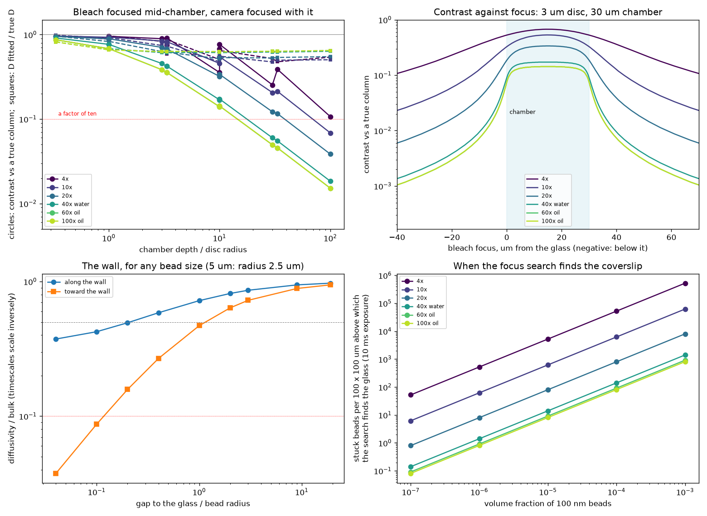

# sim-20261008-001, Stage 1: which plane a measurement depends on, and which plane the focus search will find

*Generated by `simulation_agent/src/report_focus.py` from `stage1_focus_planes.json`; the JSON is the record. Closed forms and exact integrals only -- no particle simulation, no rendered image, no model changed. Written by simulation-20261007-1 for task 026.*

**Every input was read from this agent's copy of the knowledge base, not asked of the librarian, whose server did not connect in this session.** The values are the same entries; what is missing is the record that the service answered. Answers are in decades: differences under a factor of ten are ties.

## The four answers

1. **The bleached disc is a column only at low magnification, large discs or thin chambers. At 40x to 100x a disc of 1 to 10 um in a chamber 30 um deep or more bleaches a slab a few disc radii thick, with 0.02 to 0.5 of a column's contrast.** That overturns the bead count the earlier bleach result gave, but not its diffusivity: the agreed fit reads D at 0.5 to 1 of the true value in every case computed. That is never a factor of ten, so it is a tie, and it barely depends on where the focus sits -- moving the focus from the coverslip to mid-chamber changes D by at most 1.2 times. **Focus mid-chamber for the contrast**, which there is up to 2 times the coverslip's, and hold focus to the tolerance in the table below.
2. **On the 100 nm suspension the focus search will find the coverslip, not the plane the bleach wants, unless the glass is very clean.** In a uniform suspension every plane inside the chamber looks the same to a sharpness measure, so it has no maximum there. Beads stuck to the glass make one, and only a handful per field are needed (table below). If beads stick to the top surface too, the search sees two equal peaks by construction. **For the 5 um beads the glass is not the particle plane**: they rest on it with their centres 2.5 um up, which is more than a depth of field from 20x up.
3. **The wall slows the trapped 5 um bead's in-plane motion by a factor of 2 once its centre is below about 3 um -- a gap of 0.5 um -- and by a factor of 10 only in contact.** Above that the double-well timescales are a tie with the bulk model. For the 100 nm beads the wall moves the bleach recovery by a few per cent at most.
4. **A record must hold focus to about 0.06 um/s at the strictest** -- a 30 um disc at 40x water, whose record runs about 500 s -- **and to about 50 um/s at the most forgiving**, a small disc at low magnification. After the bleach only the camera's focus matters, and at high magnification it must stay within about 3 um of the bleach plane, tighter than the bleach plane itself must be placed.

## 1. The bleach is a column only sometimes

A pattern projected through the objective is sharp only near the plane it is focused on. Away from it, each depth sees the disc blurred by a cone whose half-width grows with distance from focus, steeply at high numerical aperture. Through a chamber, the camera adds up depths bleached sharply near focus and only faintly far from it, and it sees each depth through its own blur too. Both are computed here exactly, together with the beads' diffusion in depth between the two walls, and the result is fitted the way the agreed fit does: the sharp-disc recovery, the radius taken where the first frame's dip is half its depth, a record ten recovery times long.

**D fitted / true D, and the contrast relative to a true column**, with the pattern and the camera focused together (the projection path's relation to the camera is not in the knowledge base -- see below):

| lens | disc (um) | chamber (um) | D, focus at glass | D, focus mid | contrast at glass | contrast mid | apparent mobile fraction |
|---|---|---|---|---|---|---|---|
| 4x | 1 | 10 | 0.52 | 0.51 | 0.3 | 0.36 | 1 |
| 4x | 1 | 30 | 0.53 | 0.52 | 0.16 | 0.25 | 1 |
| 4x | 1 | 100 | 0.57 | 0.54 | 0.057 | 0.11 | 0.97 |
| 4x | 3 | 10 | 0.55 | 0.59 | 0.72 | 0.75 | 1 |
| 4x | 3 | 30 | 0.5 | 0.52 | 0.53 | 0.67 | 1 |
| 4x | 3 | 100 | 0.47 | 0.48 | 0.23 | 0.39 | 1 |
| 4x | 10 | 10 | 0.86 | 0.88 | 0.91 | 0.92 | 1 |
| 4x | 10 | 30 | 0.74 | 0.83 | 0.84 | 0.9 | 1 |
| 4x | 10 | 100 | 0.56 | 0.65 | 0.59 | 0.77 | 1 |
| 4x | 30 | 10 | 0.97 | 0.98 | 0.96 | 0.96 | 1 |
| 4x | 30 | 30 | 0.93 | 0.96 | 0.94 | 0.95 | 1 |
| 4x | 30 | 100 | 0.76 | 0.87 | 0.85 | 0.92 | 1 |
| 10x | 1 | 10 | 0.47 | 0.48 | 0.29 | 0.46 | 1 |
| 10x | 1 | 30 | 0.49 | 0.47 | 0.11 | 0.21 | 0.97 |
| 10x | 1 | 100 | 0.52 | 0.5 | 0.035 | 0.069 | 0.92 |
| 10x | 3 | 10 | 0.57 | 0.66 | 0.65 | 0.79 | 1 |
| 10x | 3 | 30 | 0.5 | 0.54 | 0.33 | 0.53 | 1 |
| 10x | 3 | 100 | 0.51 | 0.5 | 0.11 | 0.21 | 0.96 |
| 10x | 10 | 10 | 0.82 | 0.91 | 0.89 | 0.93 | 1 |
| 10x | 10 | 30 | 0.62 | 0.74 | 0.7 | 0.84 | 1 |
| 10x | 10 | 100 | 0.51 | 0.56 | 0.33 | 0.55 | 1 |
| 10x | 30 | 10 | 0.96 | 0.98 | 0.95 | 0.96 | 1 |
| 10x | 30 | 30 | 0.83 | 0.92 | 0.89 | 0.94 | 1 |
| 10x | 30 | 100 | 0.61 | 0.73 | 0.67 | 0.83 | 1 |
| 20x | 1 | 10 | 0.52 | 0.52 | 0.18 | 0.32 | 0.99 |
| 20x | 1 | 30 | 0.54 | 0.53 | 0.063 | 0.12 | 0.93 |
| 20x | 1 | 100 | 0.56 | 0.55 | 0.019 | 0.038 | 0.9 |
| 20x | 3 | 10 | 0.55 | 0.6 | 0.46 | 0.67 | 1 |
| 20x | 3 | 30 | 0.53 | 0.54 | 0.19 | 0.34 | 0.98 |
| 20x | 3 | 100 | 0.55 | 0.54 | 0.06 | 0.12 | 0.92 |
| 20x | 10 | 10 | 0.7 | 0.83 | 0.8 | 0.89 | 1 |
| 20x | 10 | 30 | 0.56 | 0.63 | 0.49 | 0.71 | 1 |
| 20x | 10 | 100 | 0.53 | 0.53 | 0.19 | 0.34 | 0.98 |
| 20x | 30 | 10 | 0.89 | 0.96 | 0.92 | 0.95 | 1 |
| 20x | 30 | 30 | 0.7 | 0.83 | 0.8 | 0.89 | 1 |
| 20x | 30 | 100 | 0.55 | 0.62 | 0.46 | 0.68 | 1 |
| 40x water | 1 | 10 | 0.62 | 0.61 | 0.088 | 0.17 | 0.94 |
| 40x water | 1 | 30 | 0.63 | 0.62 | 0.03 | 0.06 | 0.9 |
| 40x water | 1 | 100 | 0.64 | 0.64 | 0.0092 | 0.018 | 0.89 |
| 40x water | 3 | 10 | 0.62 | 0.61 | 0.25 | 0.42 | 0.98 |
| 40x water | 3 | 30 | 0.61 | 0.61 | 0.09 | 0.17 | 0.93 |
| 40x water | 3 | 100 | 0.63 | 0.62 | 0.028 | 0.055 | 0.9 |
| 40x water | 10 | 10 | 0.61 | 0.68 | 0.58 | 0.77 | 1 |
| 40x water | 10 | 30 | 0.62 | 0.61 | 0.27 | 0.46 | 0.98 |
| 40x water | 10 | 100 | 0.61 | 0.61 | 0.091 | 0.17 | 0.93 |
| 40x water | 30 | 10 | 0.75 | 0.87 | 0.84 | 0.91 | 1 |
| 40x water | 30 | 30 | 0.61 | 0.68 | 0.58 | 0.77 | 1 |
| 40x water | 30 | 100 | 0.62 | 0.61 | 0.25 | 0.42 | 0.98 |
| 60x oil | 1 | 10 | 0.63 | 0.63 | 0.073 | 0.14 | 0.93 |
| 60x oil | 1 | 30 | 0.64 | 0.64 | 0.025 | 0.05 | 0.9 |
| 60x oil | 1 | 100 | 0.65 | 0.65 | 0.0076 | 0.015 | 0.89 |
| 60x oil | 3 | 10 | 0.64 | 0.63 | 0.2 | 0.36 | 0.97 |
| 60x oil | 3 | 30 | 0.63 | 0.63 | 0.075 | 0.14 | 0.93 |
| 60x oil | 3 | 100 | 0.64 | 0.64 | 0.023 | 0.046 | 0.9 |
| 60x oil | 10 | 10 | 0.62 | 0.66 | 0.5 | 0.68 | 1 |
| 60x oil | 10 | 30 | 0.64 | 0.63 | 0.23 | 0.39 | 0.97 |
| 60x oil | 10 | 100 | 0.63 | 0.62 | 0.075 | 0.14 | 0.93 |
| 60x oil | 30 | 10 | 0.71 | 0.82 | 0.77 | 0.87 | 1 |
| 60x oil | 30 | 30 | 0.62 | 0.66 | 0.5 | 0.68 | 1 |
| 60x oil | 30 | 100 | 0.63 | 0.63 | 0.2 | 0.36 | 0.97 |
| 100x oil | 1 | 10 | 0.63 | 0.63 | 0.073 | 0.14 | 0.93 |
| 100x oil | 1 | 30 | 0.64 | 0.64 | 0.025 | 0.05 | 0.9 |
| 100x oil | 1 | 100 | 0.65 | 0.65 | 0.0076 | 0.015 | 0.89 |
| 100x oil | 3 | 10 | 0.64 | 0.63 | 0.2 | 0.36 | 0.97 |
| 100x oil | 3 | 30 | 0.63 | 0.63 | 0.075 | 0.14 | 0.93 |
| 100x oil | 3 | 100 | 0.64 | 0.64 | 0.023 | 0.046 | 0.9 |
| 100x oil | 10 | 10 | 0.62 | 0.66 | 0.5 | 0.68 | 1 |
| 100x oil | 10 | 30 | 0.64 | 0.63 | 0.23 | 0.39 | 0.97 |
| 100x oil | 10 | 100 | 0.63 | 0.62 | 0.075 | 0.14 | 0.93 |
| 100x oil | 30 | 10 | 0.71 | 0.82 | 0.77 | 0.87 | 1 |
| 100x oil | 30 | 30 | 0.62 | 0.66 | 0.5 | 0.68 | 1 |
| 100x oil | 30 | 100 | 0.63 | 0.63 | 0.2 | 0.36 | 0.97 |

Read it this way. **Where the contrast is near 1 the bleach is a column, and D comes out at 0.87 to 0.98.** Where the contrast has fallen below a half, D comes out at 0.47 to 0.65: the sharp core of the dip sits on a broad shallow halo from the defocused depths, the halo widens the radius the fit measures and recovers too slowly to be fitted, and the two settle at about half. **It does not go lower however blurred the pattern gets**, because a halo much wider than the disc only adds a slow background. The same halo shows as an apparent immobile fraction of up to 0.1 where there is none.

For comparison, a camera that sees every depth equally -- the earlier result's assumption -- gives 0.46 to 0.99. **So the depth average the earlier result used is exact for that camera**, and the camera's own depth selectivity, with beads diffusing in and out of the plane it sees, moves D by less than a factor of two. A particle simulation is not needed to settle that question.

**What this corrects in the earlier bleach result (sim-20260930-401).** It found that one bleach places D in the right decade above about 300 beads in the disc, counting beads through the whole chamber depth. Only the bleached slab carries the signal, while every bead in the column adds noise, so the count that matters is the column's count times the contrast squared. **Where the contrast is 0.1 a curve needs about a hundred times the beads the earlier table gives, and where it is 0.01, ten thousand times.** Its timing limits and its diffusivity stand. It also named defocus as the likely cause of a soft-edged disc reading D two to four times low; computed directly, defocus gives about two, the low end of that range.

**Where to focus, and how precisely.** The contrast is greatest with the focus mid-chamber. These are the distances the focus may sit from there before the contrast halves and before it falls tenfold, beside the lens's depth of field:

| lens | disc (um) | chamber (um) | best contrast | halves at (um from mid) | falls tenfold at (um from mid) |
|---|---|---|---|---|---|
| 4x | 1 | 10 | 0.36 | 12 | 35 |
| 4x | 1 | 30 | 0.25 | 18 | 41 |
| 4x | 1 | 100 | 0.11 | 51 | 80 |
| 4x | 3 | 10 | 0.75 | 26 | -- |
| 4x | 3 | 30 | 0.67 | 28 | 78 |
| 4x | 3 | 100 | 0.39 | 55 | 110 |
| 4x | 10 | 10 | 0.92 | -- | -- |
| 4x | 10 | 30 | 0.9 | 68 | -- |
| 4x | 10 | 100 | 0.77 | 86 | 230 |
| 4x | 30 | 10 | 0.96 | -- | -- |
| 4x | 30 | 30 | 0.95 | -- | -- |
| 4x | 30 | 100 | 0.92 | 230 | -- |
| 10x | 1 | 10 | 0.46 | 6 | 14 |
| 10x | 1 | 30 | 0.21 | 15 | 24 |
| 10x | 1 | 100 | 0.069 | 50 | 60 |
| 10x | 3 | 10 | 0.79 | 10 | 30 |
| 10x | 3 | 30 | 0.53 | 18 | 41 |
| 10x | 3 | 100 | 0.21 | 51 | 75 |
| 10x | 10 | 10 | 0.93 | 30 | -- |
| 10x | 10 | 30 | 0.84 | 33 | 90 |
| 10x | 10 | 100 | 0.55 | 57 | 120 |
| 10x | 30 | 10 | 0.96 | -- | -- |
| 10x | 30 | 30 | 0.94 | 90 | -- |
| 10x | 30 | 100 | 0.83 | 100 | 300 |
| 20x | 1 | 10 | 0.32 | 5.2 | 9.3 |
| 20x | 1 | 30 | 0.12 | 15 | 19 |
| 20x | 1 | 100 | 0.038 | 50 | 55 |
| 20x | 3 | 10 | 0.67 | 6.8 | 17 |
| 20x | 3 | 30 | 0.34 | 16 | 28 |
| 20x | 3 | 100 | 0.12 | 50 | 62 |
| 20x | 10 | 10 | 0.89 | 15 | -- |
| 20x | 10 | 30 | 0.71 | 21 | 52 |
| 20x | 10 | 100 | 0.34 | 52 | 93 |
| 20x | 30 | 10 | 0.95 | -- | -- |
| 20x | 30 | 30 | 0.89 | 46 | -- |
| 20x | 30 | 100 | 0.68 | 68 | 170 |
| 40x water | 1 | 10 | 0.17 | 5 | 7.1 |
| 40x water | 1 | 30 | 0.06 | 15 | 17 |
| 40x water | 1 | 100 | 0.018 | 50 | 52 |
| 40x water | 3 | 10 | 0.42 | 5.4 | 11 |
| 40x water | 3 | 30 | 0.17 | 15 | 21 |
| 40x water | 3 | 100 | 0.055 | 50 | 57 |
| 40x water | 10 | 10 | 0.77 | 8.6 | 26 |
| 40x water | 10 | 30 | 0.46 | 16 | 33 |
| 40x water | 10 | 100 | 0.17 | 50 | 71 |
| 40x water | 30 | 10 | 0.91 | 20 | -- |
| 40x water | 30 | 30 | 0.77 | 26 | 78 |
| 40x water | 30 | 100 | 0.42 | 54 | 110 |
| 60x oil | 1 | 10 | 0.14 | 5 | 7.1 |
| 60x oil | 1 | 30 | 0.05 | 15 | 17 |
| 60x oil | 1 | 100 | 0.015 | 50 | 52 |
| 60x oil | 3 | 10 | 0.36 | 5.4 | 10 |
| 60x oil | 3 | 30 | 0.14 | 15 | 21 |
| 60x oil | 3 | 100 | 0.046 | 50 | 56 |
| 60x oil | 10 | 10 | 0.68 | 7.5 | 23 |
| 60x oil | 10 | 30 | 0.39 | 16 | 33 |
| 60x oil | 10 | 100 | 0.14 | 50 | 71 |
| 60x oil | 30 | 10 | 0.87 | 17 | -- |
| 60x oil | 30 | 30 | 0.68 | 22 | 68 |
| 60x oil | 30 | 100 | 0.36 | 54 | 100 |
| 100x oil | 1 | 10 | 0.14 | 5 | 7.1 |
| 100x oil | 1 | 30 | 0.05 | 15 | 17 |
| 100x oil | 1 | 100 | 0.015 | 50 | 52 |
| 100x oil | 3 | 10 | 0.36 | 5.4 | 10 |
| 100x oil | 3 | 30 | 0.14 | 15 | 21 |
| 100x oil | 3 | 100 | 0.046 | 50 | 56 |
| 100x oil | 10 | 10 | 0.68 | 7.5 | 23 |
| 100x oil | 10 | 30 | 0.39 | 16 | 33 |
| 100x oil | 10 | 100 | 0.14 | 50 | 71 |
| 100x oil | 30 | 10 | 0.87 | 17 | -- |
| 100x oil | 30 | 30 | 0.68 | 22 | 68 |
| 100x oil | 30 | 100 | 0.36 | 54 | 100 |

**In 72 of 72 cases the contrast stays within a factor of 2 of its best with the focus anywhere inside the chamber, falling to about half at the glass in the worst of them.** So the bleach is forgiving of where in the chamber it is focused; what it does not forgive is a focus well outside the chamber, below the glass or above the lid.

A dash means the contrast never fell that far with the focus anywhere from mid-chamber to three chamber depths below the glass. Distances are in the sample, not on the focus drive: the drive and the sample differ by a factor between about 0.8 and 1.3 depending on the lens, a tie.

**If the patterning light does not fill the objective's opening** -- whether it does is not recorded -- the cone is narrower and the bleach is more column-like. With the light filling 0.3 of the opening, mid-chamber contrast rises by up to 1.6 times and D reads 0.46 to 0.99. The worst case is the one tabulated.

## 2. Which plane a sharpness maximum will find

**The 100 nm beads fill the chamber**: their sedimentation length is about 20 mm. In a uniform suspension every plane inside the chamber holds the same number of beads in focus, and the out-of-focus ones are the same haze from everywhere, so a sharpness measure is flat across the interior and dips toward each wall, where half its depth of field is glass. **It has no maximum in the suspension**, and a search there returns a plane chosen by noise. The plane the bleach wants is mid-chamber, so even a search that lands in the suspension lands there only by chance.

**Beads stuck to the glass make a maximum.** They are in focus together in one plane, and they hold still, while a free bead moves during the exposure and counts for less. The search finds the glass once stuck beads outnumber the free beads in focus. The number of stuck beads in a 100 um by 100 um field above which that happens:

| lens | depth of field (um) | volume fraction 1e-6, 10 ms | 1e-5, 10 ms | 1e-4, 10 ms | 1e-4, 100 ms |
|---|---|---|---|---|---|
| 4x | 31 | 500 | 5000 | 50000 | 30000 |
| 10x | 5.9 | 60 | 600 | 6000 | 1000 |
| 20x | 1.8 | 8 | 80 | 800 | 100 |
| 40x water | 0.69 | 1 | 10 | 100 | 20 |
| 60x oil | 0.5 | 0.9 | 9 | 90 | 10 |
| 100x oil | 0.44 | 0.8 | 8 | 80 | 9 |

**From 20x up, at a volume fraction of 1e-6, 0.8 to 8 stuck beads in a 100 um field are enough**, and the number scales with the volume fraction. At 4x the depth of field is deeper than most chambers, so the glass and the suspension are in focus together and the question does not arise. Charged 100 nm beads stick to glass readily, and how many do on this bench is not recorded. So expect the search to find the glass: then the bleach is focused at the glass, with the contrast in the first table's "at glass" column. To bleach mid-chamber the plan needs the chamber's depth and a move from the found plane, and that move is the microscope plan's and the person's to set, not this card's. If beads stick to the top surface as well, there are two peaks of about equal height, a chamber depth apart, which the search should be told to expect. Choosing between them is not a sharpness question.

**The 5 um beads rest on the glass** (sedimentation length 0.2 um), so their centres are a radius, 2.5 um, above it. Against the depth of field that is:

| lens | depth of field (um) | bead centre above the glass, in depths of field |
|---|---|---|
| 4x | 34 | 0.075 |
| 10x | 6.4 | 0.39 |
| 20x | 2 | 1.3 |
| 40x water | 0.75 | 3.3 |
| 60x oil | 0.55 | 4.5 |
| 100x oil | 0.49 | 5.1 |

Below 20x the glass and the bead centres are one plane to the search. From 20x up they are distinct. **In fluorescence** the glass gives no signal unless something is stuck to it, and the search should find the bead centres. **In transmitted light** a clear bead is a lens, not a dark object. Its contrast is least at its own centre plane and greatest on either side, and it focuses light to a bright point about 8 um beyond its centre (polystyrene in water, as a thick ball lens). A peak-brightness measure will lock onto that point; a gradient measure sees two peaks either side of the bead. **Which light the search uses is not recorded.** It decides which of these the search returns. A trapped bead sits where the trap holds it, which is the experiment's.

## 3. The wall

A sphere near a flat wall moves more slowly along it, and much more slowly toward it. Far from the wall the standard reflection series holds (the first correction is 9/16 of the radius over the height); within a tenth of a radius of contact the lubrication limit replaces it, and the two agree to about 8 per cent where they meet. Motion toward the wall uses the exact series.

- **100 nm beads** (radius 0.05 um): along the wall, slowed by 10 per cent below a centre height of 0.28 um and halved below 0.06 um; slowed tenfold only in contact. Toward the wall: 10 per cent below 0.56 um, halved below 0.11 um, tenfold below 0.0558 um.
- **5 um beads** (radius 2.5 um): along the wall, slowed by 10 per cent below a centre height of 14 um and halved below 3 um; slowed tenfold only in contact. Toward the wall: 10 per cent below 28 um, halved below 5.3 um, tenfold below 2.79 um.

**The 100 nm beads in a chamber:**

| chamber (um) | depth fraction slowed by more than 10 per cent | depth-averaged diffusivity / bulk |
|---|---|---|
| 10 | 0.048 | 0.97 |
| 30 | 0.015 | 0.99 |
| 100 | 0.0046 | 1 |

The column's signal averages the beads over depth, and they cross the slow layers in milliseconds, so the recovery reads the depth average. That is a few per cent: a tie.

**The trapped 5 um bead.** Residence times and transition rates in an overdamped double well scale with the drag, so the bulk model's timescales are too short by the factor in the last column:

| centre height (um) | gap to the glass (um) | along the wall / bulk | toward the wall / bulk | timescales longer by |
|---|---|---|---|---|
| 2.6 | 0.1 | 0.37 | 0.038 | 2.7 |
| 2.8 | 0.25 | 0.42 | 0.087 | 2.4 |
| 3 | 0.5 | 0.49 | 0.16 | 2 |
| 3.5 | 1 | 0.59 | 0.27 | 1.7 |
| 5 | 2.5 | 0.72 | 0.47 | 1.4 |
| 7.5 | 5 | 0.81 | 0.64 | 1.2 |
| 10 | 7.5 | 0.86 | 0.72 | 1.2 |
| 25 | 22 | 0.94 | 0.89 | 1.1 |
| 50 | 48 | 0.97 | 0.94 | 1 |

**A factor of 2 below a centre height of about 3 um; a factor of 10 not at any height a bead can hold off the glass.** The bead's height is the experiment's -- the trap's height, or the plane the focus search found plus a known offset -- and is not recorded. A 5 um bead left free settles to a gap of about 0.2 um, where it moves along the glass at 0.4 of the bulk rate: a tie, but a factor of two any free-diffusion prediction for these beads leaves out.

## 4. Holding focus over the record

The bleach is set in the few milliseconds it lasts, so the bleach plane needs only the first item's tolerance, kept from the focus search to the bleach. After it, a drifting focus changes which depths the camera sees, and at high magnification that is the tighter of the two. Computed by moving the camera's focus away from the bleach plane and fitting again, here are the offsets at which the fitted D or the contrast moves by a factor of 2, and the drift rate that would reach that offset within the shortest record the fit allows. The offsets were tried in steps of about three times (0.3, 1, 3, 10, 30, 100 um), so each tolerance is good to that step, which is inside a decade:

| lens | disc (um) | chamber (um) | shortest record (s) | camera offset for a factor 2 (um) | drift rate to beat (um/s) |
|---|---|---|---|---|---|
| 4x | 1 | 10 | 0.58 | 30 | 50 |
| 4x | 1 | 30 | 0.58 | 30 | 50 |
| 4x | 1 | 100 | 0.58 | 30 | 50 |
| 4x | 3 | 10 | 5.2 | 30 | 6 |
| 4x | 3 | 30 | 5.2 | 100 | 20 |
| 4x | 3 | 100 | 5.2 | 100 | 20 |
| 4x | 10 | 10 | 58 | 100 | 2 |
| 4x | 10 | 30 | 58 | 100 | 2 |
| 4x | 10 | 100 | 58 | -- | -- |
| 4x | 30 | 10 | 520 | -- | -- |
| 4x | 30 | 30 | 520 | -- | -- |
| 4x | 30 | 100 | 520 | -- | -- |
| 10x | 1 | 10 | 0.58 | 10 | 20 |
| 10x | 1 | 30 | 0.58 | 10 | 20 |
| 10x | 1 | 100 | 0.58 | 10 | 20 |
| 10x | 3 | 10 | 5.2 | 30 | 6 |
| 10x | 3 | 30 | 5.2 | 30 | 6 |
| 10x | 3 | 100 | 5.2 | 30 | 6 |
| 10x | 10 | 10 | 58 | 30 | 0.5 |
| 10x | 10 | 30 | 58 | 100 | 2 |
| 10x | 10 | 100 | 58 | 100 | 2 |
| 10x | 30 | 10 | 520 | 100 | 0.2 |
| 10x | 30 | 30 | 520 | 100 | 0.2 |
| 10x | 30 | 100 | 520 | -- | -- |
| 20x | 1 | 10 | 0.58 | 10 | 20 |
| 20x | 1 | 30 | 0.58 | 10 | 20 |
| 20x | 1 | 100 | 0.58 | 10 | 20 |
| 20x | 3 | 10 | 5.2 | 10 | 2 |
| 20x | 3 | 30 | 5.2 | 30 | 6 |
| 20x | 3 | 100 | 5.2 | 30 | 6 |
| 20x | 10 | 10 | 58 | 30 | 0.5 |
| 20x | 10 | 30 | 58 | 30 | 0.5 |
| 20x | 10 | 100 | 58 | 100 | 2 |
| 20x | 30 | 10 | 520 | 100 | 0.2 |
| 20x | 30 | 30 | 520 | 100 | 0.2 |
| 20x | 30 | 100 | 520 | 100 | 0.2 |
| 40x water | 1 | 10 | 0.58 | 3 | 5 |
| 40x water | 1 | 30 | 0.58 | 3 | 5 |
| 40x water | 1 | 100 | 0.58 | 3 | 5 |
| 40x water | 3 | 10 | 5.2 | 10 | 2 |
| 40x water | 3 | 30 | 5.2 | 10 | 2 |
| 40x water | 3 | 100 | 5.2 | 10 | 2 |
| 40x water | 10 | 10 | 58 | 30 | 0.5 |
| 40x water | 10 | 30 | 58 | 30 | 0.5 |
| 40x water | 10 | 100 | 58 | 30 | 0.5 |
| 40x water | 30 | 10 | 520 | 30 | 0.06 |
| 40x water | 30 | 30 | 520 | 100 | 0.2 |
| 40x water | 30 | 100 | 520 | 100 | 0.2 |
| 60x oil | 1 | 10 | 0.58 | 3 | 5 |
| 60x oil | 1 | 30 | 0.58 | 3 | 5 |
| 60x oil | 1 | 100 | 0.58 | 3 | 5 |
| 60x oil | 3 | 10 | 5.2 | 10 | 2 |
| 60x oil | 3 | 30 | 5.2 | 10 | 2 |
| 60x oil | 3 | 100 | 5.2 | 10 | 2 |
| 60x oil | 10 | 10 | 58 | 30 | 0.5 |
| 60x oil | 10 | 30 | 58 | 30 | 0.5 |
| 60x oil | 10 | 100 | 58 | 30 | 0.5 |
| 60x oil | 30 | 10 | 520 | 30 | 0.06 |
| 60x oil | 30 | 30 | 520 | 100 | 0.2 |
| 60x oil | 30 | 100 | 520 | 100 | 0.2 |
| 100x oil | 1 | 10 | 0.58 | 3 | 5 |
| 100x oil | 1 | 30 | 0.58 | 3 | 5 |
| 100x oil | 1 | 100 | 0.58 | 3 | 5 |
| 100x oil | 3 | 10 | 5.2 | 10 | 2 |
| 100x oil | 3 | 30 | 5.2 | 10 | 2 |
| 100x oil | 3 | 100 | 5.2 | 10 | 2 |
| 100x oil | 10 | 10 | 58 | 30 | 0.5 |
| 100x oil | 10 | 30 | 58 | 30 | 0.5 |
| 100x oil | 10 | 100 | 58 | 30 | 0.5 |
| 100x oil | 30 | 10 | 520 | 30 | 0.06 |
| 100x oil | 30 | 30 | 520 | 100 | 0.2 |
| 100x oil | 30 | 100 | 520 | 100 | 0.2 |

A dash means no offset up to 100 um moved either by a factor of 2. Records use D of about 4 um^2/s. **How fast this bench's focus actually drifts is not recorded**; it is the microscope side's to measure. A drift rate below the last column means the record does not need its focus checked partway through.

## What this assumes, and what is missing

- **How the patterning light reaches the sample is not in the knowledge base**: which lens projects it, whether the pattern is in focus where the camera is, and how much of the lens's opening the light fills. The tables assume the pattern and the camera are focused together and the opening is full. If the pattern is focused elsewhere, focusing the camera does not focus the bleach, and the offset between the two has to be measured before the first table applies. **This is the most useful thing to find out.**
- The chamber's depth is not recorded: 10, 30 and 100 um span the likely range.
- How many beads stick to the glass, how fast the focus drifts, how high the trapped bead sits and which light the focus search uses are not recorded. Each is left as a range or a stated case above.
- The bleach is weak (the dip scales with the light). A strong bleach saturates the core and flattens the edges, which moves the fitted D somewhat further, as the earlier result's soft-edge table showed; still inside a factor of ten.
- The optics are geometric away from focus, with a Gaussian stand-in for diffraction near it, and no aberration. A dry lens or an oil lens focusing into water blurs more than this, so the high-magnification rows are if anything optimistic.
- The 100 nm beads are taken to be the supplier's nominal size and polystyrene of the other bead's density. That they are the product named is the person's statement, not a reading of the bottle.
- The wall formulas are for a smooth flat wall and a smooth sphere, and ignore charge, which keeps a real bead some tens of nanometres off the glass.

---
Checks before use: the column limit reproduces the textbook recovery to 3e-05; a blurred disc matches the earlier result's real-space solver to 0.0007; with a depth-blind camera the exact depth solution equals the depth average to 6e-07; the defocus kernel integrates to its closed form within 0.003.

References: task 026; corrects sim-20260930-401 (`stage1_closed_forms.md`, `stage2_runs.md`); observable `bleach_recovery_diffusivity`; knowledge-base snapshot kbv-b1253d99047e, read from files (the librarian's server did not connect); interpreter 3.12.13, numpy 2.5.3, scipy 1.18.1, outside the sim environment.
